# 🌾 AgriChain: Agricultural Supply Chain Smart Contract Platform

[](https://opensource.org/licenses/MIT)
[](https://soliditylang.org/)
[](https://hardhat.org/)
[](https://openzeppelin.com/)
[](https://github.com/ac12644/Supply-Chain-Smart-Contract/actions/workflows/hardhat-test.yml)

> **A production-ready blockchain solution for agricultural supply chain management with comprehensive traceability, secure payments, and quality assurance.**

## 📋 Table of Contents

- [Overview](#-overview)
- [Key Features](#-key-features)
- [Architecture](#-architecture)
- [Supply Chain Flow](#-supply-chain-flow)
- [Smart Contract Components](#-smart-contract-components)
- [Installation & Setup](#-installation--setup)
- [Usage](#-usage)
- [Testing](#-testing)
- [Deployment](#-deployment)
- [API Reference](#-api-reference)
- [Security](#-security)
- [Contributing](#-contributing)
- [License](#-license)

## 🌟 Overview

AgriChain is an enterprise-grade blockchain platform designed specifically for agricultural supply chain management. Built on Ethereum with Hardhat framework and OpenZeppelin security standards, it provides end-to-end traceability from farm to consumer with advanced features including escrow payments, dispute resolution, reputation systems, and comprehensive quality assurance.

### 🎯 Business Value

- **Complete Traceability**: Track products from farm to consumer
- **Financial Security**: Escrow-based payments with dispute resolution
- **Quality Assurance**: Built-in expiration tracking and quality controls
- **Trust Building**: Reputation system for all participants
- **Compliance Ready**: IPFS metadata storage for certificates and documentation
- **Scalable Operations**: Batch processing for efficient management

## 🚀 Key Features

### 🔒 **Security & Trust**

- **Reentrancy Protection**: OpenZeppelin ReentrancyGuard implementation
- **Role-Based Access Control**: Secure permissions for farmers, distributors, retailers, consumers
- **User Verification**: Admin-controlled user verification system
- **Emergency Controls**: Pausable functionality for crisis management
- **Input Validation**: Comprehensive validation for all operations

### 💰 **Financial Management**

- **Escrow Payments**: Secure multi-party payment system
- **Dispute Resolution**: Built-in arbitration with multiple resolution options
- **Automatic Refunds**: Timeout-based refund mechanisms
- **Price Validation**: Configurable price ranges and validation
- **Gas Optimization**: Efficient contract design for cost-effective operations

### 🏆 **Reputation & Quality**

- **5-Star Rating System**: Comprehensive user rating mechanism
- **Transaction History**: Success/failure tracking for reputation building
- **Quality Assurance**: Expiration tracking and deadline management
- **Review Verification**: Admin-verified review system
- **Reputation Levels**: Automated reputation scoring algorithm

### ⚡ **Performance & Scalability**

- **Batch Operations**: Process up to 50 products simultaneously
- **IPFS Integration**: Off-chain metadata storage for cost efficiency
- **Gas Optimization**: Packed structs and efficient storage patterns
- **Event Optimization**: Minimal gas cost event emission
- **Cross-chain Ready**: Designed for future multi-chain deployment

## 🏗️ Architecture


## 🔄 Supply Chain Flow

```mermaid
flowchart TD
    A[🌱 Farmer Produces Product] --> B[📝 Add IPFS Metadata]
    B --> C[💰 Set Price & List for Sale]
    C --> D[🛒 Distributor Purchases]
    D --> E[💸 Escrow Payment Created]
    E --> F[🚚 Farmer Ships Product]
    F --> G[📦 Distributor Receives]
    G --> H[⚙️ Distributor Processes]
    H --> I[📋 Distributor Packages]
    I --> J[💰 Distributor Lists for Sale]
    J --> K[🛒 Retailer Purchases]
    K --> L[💸 Escrow Payment Created]
    L --> M[🚚 Distributor Ships]
    M --> N[📦 Retailer Receives]
    N --> O[💰 Retailer Lists for Sale]
    O --> P[🛒 Consumer Purchases]
    P --> Q[💸 Escrow Payment Created]
    Q --> R[✅ Transaction Complete]

    style A fill:#e8f5e8
    style R fill:#e8f5e8
    style E fill:#fff3e0
    style L fill:#fff3e0
    style Q fill:#fff3e0
```



## 📦 Smart Contract Components

### Core Components

#### Smart Contracts

| Contract            | Purpose                      | Key Features                                           |
| ------------------- | ---------------------------- | ------------------------------------------------------ |
| **SupplyChain.sol** | Main supply chain logic      | Product lifecycle, state management, batch operations  |
| **Escrow.sol**      | Payment & dispute resolution | Secure payments, arbitration, automatic refunds        |
| **Reputation.sol**  | User reputation system       | Rating system, transaction history, reputation scoring |
| **Access Control**  | Role-based permissions       | Farmer, Distributor, Retailer, Consumer roles          |

#### Frontend Application

| Component            | Purpose                 | Key Features                               |
| -------------------- | ----------------------- | ------------------------------------------ |
| **Next.js App**      | Modern web interface    | React 18, TypeScript, App Router           |
| **shadcn/ui**        | Component library       | Accessible, customizable UI components     |
| **Web3 Integration** | Blockchain connectivity | MetaMask integration, contract interaction |
| **Dashboard**        | User interface          | Product management, role-based views       |

### Contract Relationships


## 🛠️ Installation & Setup

### Prerequisites

- **Node.js**: v16.17.0 or higher
- **Hardhat**: v2.22.0 or higher
- **Solidity**: ^0.8.24
- **Git**: For version control

### Quick Start

1. **Clone the repository**

   ```bash
   git clone https://github.com/your-org/agrichain-supply-chain.git
   cd agrichain-supply-chain
   ```

2. **Install dependencies**

   ```bash
   npm install
   ```

3. **Compile contracts**

   ```bash
   npm run compile
   ```

4. **Start local Hardhat network**

   ```bash
   npm run node
   ```

5. **Deploy contracts (Localhost)**

   ```bash
   npm run deploy:localhost
   ```

6. **Deploy to Polygon Amoy (Testnet)**

   ```bash
   # Set up environment variables
   cp .env.template .env
   # Edit .env with your private key and PolygonScan API key

   # Deploy to Amoy
   npm run deploy:amoy
   ```

7. **Start frontend**

   ```bash
   cd frontend
   npm install
   npm run dev
   ```

8. **Open application**

   ```
   http://localhost:3000
   ```

9. **Run tests**
   ```bash
   npm test
   ```

### Frontend Configuration

After deploying contracts, update the frontend configuration:

**For Amoy Testnet:**

```bash
cd frontend
cp env.local.example .env.local
# Edit .env.local with Amoy contract addresses
```

**For Localhost:**

```bash
cd frontend
cp env.local.example .env.local
# Edit .env.local with localhost contract addresses
```

**MetaMask Network Configuration:**

- **Network Name**: Polygon Amoy
- **RPC URL**: https://rpc-amoy.polygon.technology/
- **Chain ID**: 80002
- **Currency Symbol**: MATIC
- **Block Explorer**: https://amoy.polygonscan.com/

### Environment Configuration

Create a `.env` file in the root directory:

```env
# Private key for deployment (without 0x prefix)
PRIVATE_KEY=your_private_key_here

# RPC URLs
AMOY_RPC_URL=https://rpc-amoy.polygon.technology/
POLYGON_RPC_URL=https://polygon-rpc.com
SEPOLIA_RPC_URL=https://sepolia.infura.io/v3/YOUR_INFURA_KEY
MAINNET_RPC_URL=https://mainnet.infura.io/v3/YOUR_INFURA_KEY

# Block Explorer API Keys
POLYGONSCAN_API_KEY=your_polygonscan_api_key
ETHERSCAN_API_KEY=your_etherscan_api_key

# Gas Reporting
REPORT_GAS=true
```

## 🌐 Deployed Contracts

### Polygon Amoy Testnet (Live)

| Contract        | Address                                      | Explorer                                                                                               |
| --------------- | -------------------------------------------- | ------------------------------------------------------------------------------------------------------ |
| **SupplyChain** | `0xb9e1c42741DE05e9957C50D52ded2f2A55843524` | [View on PolygonScan](https://amoy.polygonscan.com/address/0xb9e1c42741DE05e9957C50D52ded2f2A55843524) |
| **Escrow**      | `0x3F56D16dcDEE1221E447e8A1dC6C91f6d9DEc347` | [View on PolygonScan](https://amoy.polygonscan.com/address/0x3F56D16dcDEE1221E447e8A1dC6C91f6d9DEc347) |
| **Reputation**  | `0xa19dEDA6c56d005eF24c21DE822Dd83b529D205b` | [View on PolygonScan](https://amoy.polygonscan.com/address/0xa19dEDA6c56d005eF24c21DE822Dd83b529D205b) |

**Network Details:**

- **Network**: Polygon Amoy Testnet
- **Chain ID**: 80002
- **RPC URL**: https://rpc-amoy.polygon.technology/
- **Block Explorer**: https://amoy.polygonscan.com/

### Localhost Development

| Contract        | Address                                      |
| --------------- | -------------------------------------------- |
| **SupplyChain** | `0x9fE46736679d2D9a65F0992F2272dE9f3c7fa6e0` |
| **Escrow**      | `0x5FbDB2315678afecb367f032d93F642f64180aa3` |
| **Reputation**  | `0xe7f1725E7734CE288F8367e1Bb143E90bb3F0512` |

## 📖 Usage

### Basic Workflow

#### 1. **Farmer Operations**

```javascript
// Produce agricultural product
await supplyChain.produceItemByFarmer(
  0, // productCode (auto-generated)
  'QmHash123...', // IPFS hash for metadata
  ethers.parseEther('0.1'), // price
  Math.floor(Date.now() / 1000) + 86400 // shipping deadline
);

// List product for sale
await supplyChain.sellItemByFarmer(productCode, ethers.parseEther('0.15'));

// Ship product after purchase
await supplyChain.shippedItemByFarmer(productCode);
```

#### 2. **Distributor Operations**

```javascript
// Purchase from farmer
await supplyChain.purchaseItemByDistributor(productCode, {
  value: ethers.parseEther('0.15'),
});

// Receive and process product
await supplyChain.receivedItemByDistributor(productCode);
await supplyChain.processedItemByDistributor(productCode, 5); // 5 slices
await supplyChain.packageItemByDistributor(productCode);

// Sell to retailer
await supplyChain.sellItemByDistributor(productCode, ethers.parseEther('0.25'));
```

#### 3. **Retailer Operations**

```javascript
// Purchase from distributor
await supplyChain.purchaseItemByRetailer(productCode, {
  value: ethers.parseEther('0.25'),
});

// Receive and sell to consumer
await supplyChain.receivedItemByRetailer(productCode);
await supplyChain.sellItemByRetailer(productCode, ethers.parseEther('0.35'));
```

#### 4. **Consumer Operations**

```javascript
// Purchase final product
await supplyChain.purchaseItemByConsumer(productCode, {
  value: ethers.parseEther('0.35'),
});
```

### Advanced Features

#### Batch Operations

```javascript
// Create batch operation for multiple products
const productCodes = [1, 2, 3, 4, 5];
await supplyChain.createBatchOperation(productCodes);
```

#### Reputation Management

```javascript
// Add review for a participant
await reputation.addReview(
  farmerAddress,
  5, // 5-star rating
  'Excellent quality produce!'
);

// Record successful transaction
await reputation.recordTransactionSuccess(farmerAddress);
```

#### Escrow Management

```javascript
// Open dispute if needed
await escrow.openDispute(
  escrowId,
  'Product quality issue',
  { value: ethers.parseEther('0.01') } // arbitration fee
);

// Resolve dispute (arbitrator only)
await escrow.resolveDispute(escrowId, 1); // Resolution.Buyer
```

## 🧪 Testing

### Test Coverage

The test suite includes comprehensive coverage for:

- ✅ **Product Creation & Management** (3 tests)
- ✅ **Sale & Purchase Operations** (3 tests)
- ✅ **Complete Supply Chain Flow** (1 test)
- ✅ **Batch Operations** (2 tests)
- ✅ **Reputation System** (3 tests)
- ✅ **Escrow & Dispute Resolution** (3 tests)
- ✅ **Access Control** (2 tests)
- ✅ **Pause Functionality** (1 test)

**Total: 18 tests passing**

### Running Tests

```bash
# Run all tests
npm test

# Run specific test file
npx hardhat test test/SupplyChain.test.js

# Run with gas reporting
REPORT_GAS=true npm test

# Run with coverage
npx hardhat coverage
```

### Test Results

```
SupplyChain
  Product Creation
    ✔ Should create a product successfully
    ✔ Should reject product creation with invalid price
    ✔ Should reject product creation with past deadline
  Product Sale and Purchase
    ✔ Should allow farmer to sell product
    ✔ Should allow distributor to purchase product with escrow
    ✔ Should reject purchase with insufficient payment
  Supply Chain Flow
    ✔ Should complete full supply chain flow
  Batch Operations
    ✔ Should create batch operation
    ✔ Should reject batch operation exceeding limit
  Reputation System
    ✔ Should add review
    ✔ Should verify review and update reputation
    ✔ Should record successful transaction
  Escrow System
    ✔ Should create escrow for purchase
    ✔ Should open dispute
    ✔ Should resolve dispute
  Access Control
    ✔ Should reject unauthorized user actions
    ✔ Should reject unverified user actions
  Pause Functionality
    ✔ Should pause and unpause contract

18 passing (747ms)
```

## 🚀 Deployment

### Local Development

```bash
# Start local Hardhat node
npm run node

# Deploy to local network
npm run deploy:localhost
```

### Testnet Deployment

```bash
# Deploy to Mumbai testnet
npm run deploy:mumbai

# Deploy to Sepolia testnet
npm run deploy:sepolia
```

### Mainnet Deployment

```bash
# Deploy to Polygon mainnet
npm run deploy:polygon

# Deploy to Ethereum mainnet
npm run deploy:mainnet
```

### Verification

Contracts are automatically verified on block explorers after deployment:

```bash
# Manual verification if needed
npx hardhat verify --network mumbai <CONTRACT_ADDRESS> <CONSTRUCTOR_ARGS>
```

## 📚 API Reference

### SupplyChain Contract

#### Core Functions

| Function                     | Description                     | Parameters                                     | Returns |
| ---------------------------- | ------------------------------- | ---------------------------------------------- | ------- |
| `produceItemByFarmer`        | Create new agricultural product | `productCode`, `ipfsHash`, `price`, `deadline` | -       |
| `sellItemByFarmer`           | List product for sale           | `productCode`, `price`                         | -       |
| `purchaseItemByDistributor`  | Buy product with escrow         | `productCode`                                  | -       |
| `shippedItemByFarmer`        | Mark product as shipped         | `productCode`                                  | -       |
| `receivedItemByDistributor`  | Confirm product receipt         | `productCode`                                  | -       |
| `processedItemByDistributor` | Process/slice product           | `productCode`, `slices`                        | -       |
| `packageItemByDistributor`   | Package processed product       | `productCode`                                  | -       |
| `sellItemByDistributor`      | List processed product          | `productCode`, `price`                         | -       |
| `purchaseItemByRetailer`     | Buy from distributor            | `productCode`                                  | -       |
| `shippedItemByDistributor`   | Ship to retailer                | `productCode`                                  | -       |
| `receivedItemByRetailer`     | Confirm retailer receipt        | `productCode`                                  | -       |
| `sellItemByRetailer`         | List for consumer sale          | `productCode`, `price`                         | -       |
| `purchaseItemByConsumer`     | Final consumer purchase         | `productCode`                                  | -       |

#### Utility Functions

| Function               | Description             | Parameters     | Returns     |
| ---------------------- | ----------------------- | -------------- | ----------- |
| `fetchItem`            | Get product details     | `productCode`  | `Item`      |
| `fetchItemHistory`     | Get transaction history | `productCode`  | `Txblocks`  |
| `getUserProducts`      | Get user's products     | `user`         | `uint256[]` |
| `getTotalProductCount` | Get total products      | -              | `uint256`   |
| `createBatchOperation` | Create batch operation  | `productCodes` | `uint256`   |
| `checkExpiredProducts` | Check expired products  | `productCodes` | -           |

### Escrow Contract

| Function         | Description               | Parameters                                   | Returns   |
| ---------------- | ------------------------- | -------------------------------------------- | --------- |
| `createEscrow`   | Create escrow payment     | `productCode`, `buyer`, `seller`, `deadline` | `uint256` |
| `releasePayment` | Release payment to seller | `escrowId`                                   | -         |
| `refundPayment`  | Refund payment to buyer   | `escrowId`                                   | -         |
| `openDispute`    | Open dispute              | `escrowId`, `reason`                         | -         |
| `resolveDispute` | Resolve dispute           | `escrowId`, `resolution`                     | -         |
| `addArbitrator`  | Add arbitrator            | `arbitrator`                                 | -         |

### Reputation Contract

| Function                   | Description         | Parameters                      | Returns          |
| -------------------------- | ------------------- | ------------------------------- | ---------------- |
| `registerUser`             | Register new user   | `user`                          | -                |
| `addReview`                | Add review          | `reviewee`, `rating`, `comment` | `uint256`        |
| `verifyReview`             | Verify review       | `reviewId`                      | -                |
| `recordTransactionSuccess` | Record success      | `user`                          | -                |
| `recordTransactionFailure` | Record failure      | `user`                          | -                |
| `getUserReputation`        | Get user reputation | `user`                          | `ReputationData` |
| `calculateReputationLevel` | Calculate level     | `user`                          | `string`         |

## 🔒 Security

### Security Features

- **Reentrancy Protection**: OpenZeppelin ReentrancyGuard
- **Access Control**: Role-based permissions with verification
- **Input Validation**: Comprehensive parameter validation
- **Emergency Controls**: Pausable functionality
- **Gas Optimization**: Efficient storage and operations
- **Audit Ready**: Clean, well-documented code

### Security Best Practices

1. **Always verify user roles** before allowing operations
2. **Use escrow payments** for high-value transactions
3. **Implement proper access controls** for admin functions
4. **Monitor contract state** for suspicious activities
5. **Keep private keys secure** and use hardware wallets
6. **Regular security audits** before mainnet deployment

### Known Limitations

- **IPFS Dependency**: Requires IPFS for metadata storage
- **Gas Costs**: Ethereum mainnet gas costs can be high
- **Scalability**: Limited by blockchain throughput
- **Off-chain Data**: Some data stored off-chain for efficiency

## 🧪 Testing the Application

### Test on Polygon Amoy

1. **Add Amoy Network to MetaMask:**
   - Network Name: Polygon Amoy
   - RPC URL: https://rpc-amoy.polygon.technology/
   - Chain ID: 80002
   - Currency Symbol: MATIC
   - Block Explorer: https://amoy.polygonscan.com/

2. **Get Testnet MATIC:**
   - Visit [Polygon Faucet](https://faucet.polygon.technology/)
   - Request Amoy testnet MATIC tokens

3. **Start Frontend:**

   ```bash
   cd frontend
   npm run dev
   ```

4. **Test Workflow:**
   - Connect MetaMask to Amoy network
   - Open http://localhost:3000
   - Connect wallet
   - Test farmer operations (create products)
   - Test distributor operations (purchase, process)
   - Test retailer operations (resell)
   - Test consumer operations (final purchase)

### Test Scenarios

**Farmer Testing:**

- Create agricultural product
- Set price and shipping deadline
- List product for sale
- Ship product to distributor

**Distributor Testing:**

- Purchase product from farmer
- Confirm receipt
- Process product (slice into smaller units)
- Package processed product
- List for sale to retailer

**Retailer Testing:**

- Purchase from distributor
- Confirm receipt
- List for consumer sale

**Consumer Testing:**

- Purchase final product
- Complete supply chain

### View Transactions

All transactions are visible on [Amoy PolygonScan](https://amoy.polygonscan.com/):

- Contract interactions
- Token transfers
- Event logs
- Gas usage

## 🤝 Contributing

We welcome contributions to AgriChain! Please follow these guidelines:

### Development Process

1. **Fork the repository**
2. **Create a feature branch**: `git checkout -b feature/amazing-feature`
3. **Make your changes** and add tests
4. **Run the test suite**: `npm test`
5. **Commit your changes**: `git commit -m 'Add amazing feature'`
6. **Push to the branch**: `git push origin feature/amazing-feature`
7. **Open a Pull Request**

### Code Standards

- **Solidity**: Follow Solidity style guide
- **JavaScript**: Use ESLint configuration
- **Tests**: Maintain 100% test coverage
- **Documentation**: Update README for new features
- **Commits**: Use conventional commit messages

### Issue Reporting

When reporting issues, please include:

- **Environment details**: Node.js version, OS, etc.
- **Steps to reproduce**: Clear reproduction steps
- **Expected behavior**: What should happen
- **Actual behavior**: What actually happens
- **Screenshots/logs**: If applicable

## 📄 License

This project is licensed under the MIT License - see the [LICENSE](LICENSE) file for details.

## 🙏 Acknowledgments

- **OpenZeppelin**: For secure, audited smart contract libraries
- **Hardhat**: For the excellent development environment
- **Ethereum Foundation**: For the blockchain platform
- **IPFS**: For decentralized storage solutions
- **Community**: For feedback and contributions

## 📞 Support

- **Documentation**: [GitHub Wiki](https://github.com/your-org/agrichain-supply-chain/wiki)
- **Issues**: [GitHub Issues](https://github.com/your-org/agrichain-supply-chain/issues)
- **Discussions**: [GitHub Discussions](https://github.com/your-org/agrichain-supply-chain/discussions)
- **Email**: support@agrichain.com

---

<div align="center">

**Built with ❤️ for the agricultural community**

[⭐ Star this repo](https://github.com/your-org/agrichain-supply-chain) | [🐛 Report Bug](https://github.com/your-org/agrichain-supply-chain/issues) | [💡 Request Feature](https://github.com/your-org/agrichain-supply-chain/issues)

</div>
